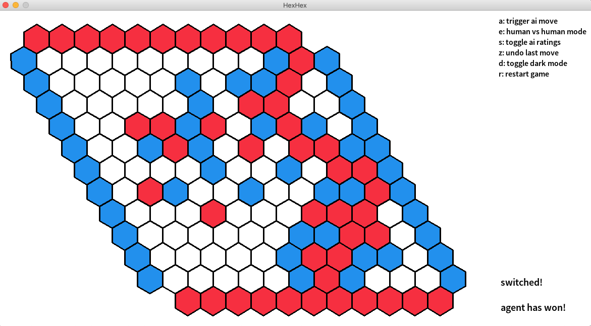

# HexHex

Reinforcement learning agent for the board game hex only trained by self-play.


Finished game of HexHex. Red won because he connected the two red rows on the top and bottom.

Our agent uses a similar neural network architecture and training methods as used in AlphaGo Zero (Silver et al. (2017). "Mastering the game of Go without human knowledge". Nature. 550 (7676): 354–359).

To our surprise, the agent is became very strong even without Monte Carlo Tree Search (MCTS). 
This means training data can quickly be generated without hundreds of roll-outs per move.
Instead, we use only one feed-forward pass through the neural network to generate ratings for all potential moves.
The agent simply picks the field with the highest score, potentially randomized by applying a softmax with temperature > 0.
This allows to generate and train on millions of training positions on a single machine within days. 

## Play against a pretrained agent

It is easy to play against our agent. A fully trained model is already included in the repository. Python 3.6 or newer is required.

```
git clone https://github.com/harbecke/hex && cd hex
pip install torch pygame numpy
python main.py
```

Note that both players can make use of the switch rule.
Some starting moves are much better than others, the switch rule forces the first player to pick a more neutral move.
This means after the first player (red) makes the first move, the second player (blue) can switch colors and take over this first move.
The game continues by the first player (now blue) making the second move.

## Training your own agent

### Option 1: Manual Installation

* install Python 3.7

* install Pytorch 1.2 (see [here](https://pytorch.org/get-started/locally/) for installation info)

* install requirements.txt `pip install -r requirements.txt`

### Option 2: Installation with pipenv

```
# install pipenv to manage dependencies
pip install pipenv 

# install dependencies
# use --skip-lock due to a recent regression in pipenv: https://github.com/pypa/pipenv/issues/2284
pipenv install -r requirements.txt --skip-lock

# activate virtual environment
pipenv shell 
```

### Execution

* copy `sample_files` into root directory `cp sample_files/* .`

* run scripts and notebooks from root directory
    - `python -m hex.training.repeated_self_training` for training a model with parameters in `config.ini`
    - `python -m hex.training.bayesian_optimization` for Bayesian optimization of parameters and ranges specified in `bo_parameters.json`
    - `python -m hex.interactive.interactive` for playing against a trained model in a gui

* both scripts use reference models from `reference_models.json`
    - insert "random" for the dict of your current board size for a random reference model
    - insert "{your_model_name}" for an already trained model as reference model

### Visualize Training with Tensorboard
Training will automatically create log files for tensorboard.
Those can be viewed with

`python3 -m tensorboard.main --logdir runs/`

### Visualize Bayesian optimization with jupyter
Bayesian optimization will automatically create a pickle file in `data/bayes_experiments`.
Run jupyter notebook, insert the correct name in the second cell and run the cells.

### Loading Into hexgui
[hexgui](https://github.com/ryanbhayward/hexgui) can be used for interactive play as well.
It also allows replay view of `FF4` files generated by `hexboard.export_as_FF4`.
To load the hex ai into hexgui:
- go to `Program -> new program`
- enter command to start `play_cli.py`. Note that the working directory option is not supported. 
If you use `pipenv`, you might have to create a bash script for this purpose:
```bash
#!/bin/bash
cd /path/to/hex
pipenv run python play_cli.py
```
- The ai can then be used by `Program -> connect local program`

## Features

* board representation with logic + switch rule

* network to evaluate positions
  * output activation of network is sigmoid for each stone
  * these are probabilities of how likely that stone wins the game
  * loss function is between prediction of selected stone and outcome of game

* creating models with hyperparameters
* batch-wise self-play to generate datasets
* training and validating models
* evaluating models against each other
* ELO rating via `output_ratings` in `hex/elo/elo.py`
* iterative training loop
* puzzle set for endgame evaluation

* config to control plenty of hyperparameters
* Bayesian optimization to tune hyperparameters

* playable gui
